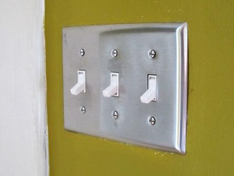

# Text in HTML

## Using light switches for messages

  -- 2 messages
 -- 4 messages
 -- 8 messages

## Of Bits and Bytes

* A bit stores a one or a zero

|Number of Bits|Number of Possible Combinatins|Examples|
|:---:|:---:|:---:|
|1|2|0,1|
|2|4|00, 01, 10, 11|
|3|8|000,001,010,011,100,101,110,111|
|4|16|0000,0001,0010,0011,0100,0101,0110,0111,1000,1001,1010,1011,1100,1101,1110,1111
|5|32|-|
|6|64|-|
|7|128|-|
|8|256|-|

The formula for the number of combinations is 2ⁿ where n is the number of bits.

### Number Systems

* Decimal -- Base 10
* Binary -- Base 2  This is the base used inside the computer
* Hexadecimal or "Hex" -- Base 16

Hex is often used as a shorthand for writing binary. Hex is easier for humans to deal with than straight binary.

## Character Sets

* ASCII character set
  * Assigns each character a number
  * [ASCII Table](http://www.asciitable.com/)
  * Basic ASCII codes cover all the alphabetic characters used in English
  * 7 bits, 127 characters.
  * Modern computers use 8-bit bytes.  2⁸ is 256.  So another 127 characters could be added.  A lot of these new characters were for western European characters.

* Unicode characters set
  * ASCII does not serve as an international coding system.
  * [Unicode](http://www.unicode.org/charts/) supports most alphabets of the world as well as special symbols.
  * ASCII lives on as the first code table in Unicode, so ASCII is a subset of Unicode.

## Back at the HTML

Content in this section is also covered in the following references:

* Duckett textbook, chapter 2
* HTML Tutorial content:
  * [Text Formatting](https://www.w3schools.com/html/html_formatting.asp)
  * [Comments](https://www.w3schools.com/html/html_comments.asp)

## All content must be in a tag

All text must be in a paragraph or some other type of container.

## Character formatting

The following are discussed in the [html tutorial](https://www.w3schools.com/html/html_formatting.asp)  There is also material on them in the Duckett text.

### Inline elements

The following are all "inline" elements.  Inline elements go inside block elements.

* &lt;b&gt; - Bold text
* &lt;strong&gt; - Important text (Usually the same thing as bold)
* &lt;i&gt; - Italic text
* &lt;em&gt; - Emphasized text (Usually the same thing as italic)
* &lt;mark&gt; - Marked text
* &lt;small&gt; - Small text
* &lt;del&gt; - Deleted text
* &lt;ins&gt; - Inserted text
* &lt;sub&gt; - Subscript text
* &lt;sup&gt; - Superscript text

### bold and strong, italics and emphasis

Here we get into a bit of an argument among the people who take html very seriously.  Most browsers interpret &lt;strong&gt; as the same thing as **bold.**  Similarly, most browsers interpret &lt;em&gt; as *italics.*  

Remember that html is supposed to represent structure and meaning, not style.  Therefore html purists insist that we should use only &lt;strong&gt; and &lt;em&gt; and never use the &lt;b&gt; and &lt;i&gt;.  On the other hand the &lt;b&gt; and &lt;i&gt; are easier to remember and are clear to human readers.

### Self-closing tag, and html5

HTML5 allows a tag like &lt;hr&gt;.  Previous versions of html required self-closing tags to be written as &lt;hr /&gt; with a / at the end of the tag.  My fingers may still type self-closing tags like this.  It is allowed in html5, but not required.

## Non-breaking white space

This is not strictly html.  It is an "html entity."  

ASCII code 255 is a "hard space" or "non-breaking white space."  It looks like a space, but the browser will not try to word wrap on the hard space.   It is represented as **&amp;nbsp;**

Sometimes we use **&amp;nbsp;** to join words we want to split.  But often we use the **&amp;nbsp;** entity to fill a space we want to appear empty.

Also, the **&amp;nbsp;** is not collapsed like regular white space.  So sometimes it is used to space out text into a certain format.

## &lt;!-- Comments --&gt;

Comments do not show up when the browser renders the web page.  They are notes to the programmer, or to people who look at the source code later.

If you take a programming course like Java the instructors want you to put in a lot of comments.  However, in html we do not want a lot of comments.  Comments still have to be downloaded, and that takes bandwidth.  If you have a web page that is being served millions of times a day, then the extra comments can end up costing a lot of money and slowing delivery of your web page.

One other thing.  Do not use comments to block out code that did not work properly.  I will deduct points if you have commented out code in assignments you turn in!
