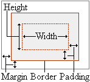

# 06_35 The Box model

https://www.w3schools.com/css/css_boxmodel.asp



---

## padding

Reference: https://www.w3schools.com/css/css_padding.asp 

* Padding is the space between the edge of the text and the edge of the container.
* The default is 0 padding, so the text on the left and right will slam right against the edge of the container.
* Usually you specify the value for padding as px or em.
* The padding area shares the background color of the element.

```css
.highlight {background-color: bisque;
            float:right;
            width: 30%;
            padding: 0.5em;
        }
```

If you do padding as in the above example, the same amount of padding with be applied to the sides as well as the top and bottom of the element.  You may specify the amount of padding you actually want. on the left, right, top and bottom.  There is also a shorthand available that I do not expect you to learn for the exam.

```css
.highlight {background-color: bisque;
            float:right;
            width: 30%;
            padding-left: 1em;
            padding-right: 0.5em;
            padding-top: 2px;
            padding-bottom:1px:
        }
```

---

## border

Reference: https://www.w3schools.com/css/css_border.asp

Borders can be complex, so start simple and add sophistication as you need it.

A border is immediately outside padding, if any

* border-width is specified in the usual measures.  1px is common.
* border-style is one of several values, but the most common is "solid"
* border-color is any standard color.  If not specified, the color of the element is used.

```css
.highlight {background-color: bisque;
            float:right;
            width: 30%;
            padding-left: 1em;
            padding-right: 0.5em;
            padding-top: 2px;
            padding-bottom:1px:
            border-width: 1px;
        }
```
### Shorthand border property

```css
            border: 1px solid black;
```
---

## margin

Reference: https://www.w3schools.com/css/css_margin.asp

* Margins are *outside* the border
* Margins take the color of the container, not the element
* Adjacent margins overlap.  For example, if an element has a bottom margin of 15px and the item below it has a margin of 10px, then you might expect a total margin of 25px.  But the margins overlap, so the margin would actually be 15px.  

