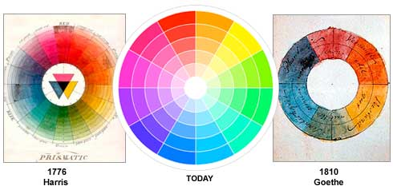
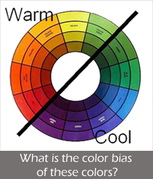
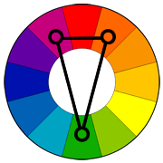
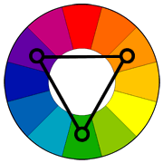
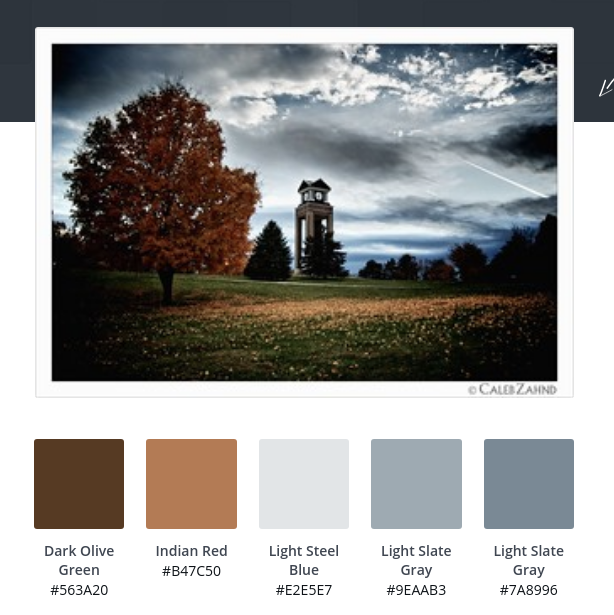

# 07_30 Selecting Colors

## References

* Good examples of using color combinations: https://99designs.com/blog/tips/the-7-step-guide-to-understanding-color-theory/
* Good descriptions of color harmonies: https://www.tigercolor.com/color-lab/color-theory/color-harmonies.htm

## Disclaimer

Some people seem to have a natural ability to pick good color combinations.  And then there are people like me.  I am terrified when I have to pick colors.  This lecture is mostly for people like me who have a hard time picking colors.  Things I would like to achieve here:

* Give a basic understanding of some of the tools available to help make color choices that are not horrible.
* Present the basic vocabulary so that if you are lucky enough to have an artist available you may be able to understand some of the basics of what they are considering.  Or, if you are the artist, perhaps give you some ideas about how to talk to people like me.

## Reminder: RGB vs RYG

Remember that light and print are different.  Color wheels that move to black in the center are based on pigments and represent subtractive color.  For most web applications we need additive colors which are Red, Green, and Blue.  The following image shows both.  Note tha the RGB color wheel goes to light in the middle. 

## First rule of design:  Make the design match the topic

Do not pick colors just because you like them.  Pick colors that are appropriate to content you are presenting.  If it is a story about an exciting sports contest, then use a color scheme that convey the vivid and dynamic nature of the game.  If you are writing a eulogy, then make sure the colors reflect the dignity of the topic.

## Color Temperature

Note that this color wheel gets dark toward the middle.  But the principles still apply.

* Warm colors are the colors of a sunny day or a sunset.  Reds, Yellows, and Oranges are warm colors.  Browns are considered warm colors.
* Blues and purples are the colors of overcast days.  Gray is considered a warm color.
* Greens tend to fall into both warm and cool color palettes.

Warm colors tend to catch attention.  They are generally more vibrant and exciting.

Cool colors are thought to be more relaxing and tend to fade into the backgroud.

Side note:  If you are a science geek the "warm" and "cool" designations are backwards from what we usually see in physics.  For example, a "red hot" piece of iron is cooler than one that is blue.

## Color Wheel

We will use this color calculuator: https://www.sessions.edu/color-calculator/

To use the color wheel, click on the dot in the white part of the circle and drag it out into a warm or cool color of your choice.  This will probably be the primary color of the color scheme.  Then click on the one of the "harmony" options (Try Complimentary first). Slide the dot for the priary color around until you find what you want.

### Complimentary Colors

Complimentary colors are on opposite sides of the color wheel.  There is a sharp contrast and often a sense of tension or conflict.  Consider [this logo for a spicy product](https://99designs-blog.imgix.net/blog/wp-content/uploads/2017/02/attachment_77636549-e1487960828594.jpg?auto=format&q=60&fit=max&w=930).

Too much complimentary color schemes can get tiresome.

### Monochromatic Colors

These are shades of the same color Generally the primary color is darker, and other colors in the palette are lighter (more white).  The color calculator only gives you two colors, but if you slide the primary color along the radius of the circle you can get other colors that will still be monochromatic

In practice monochromatic color schemes are often cooler colors.  They add a bit of accent, but the colors tend to be not as important as the content of the page.

### Analogus Colors

Analogus Colors are near each other on the color wheel.  Many color schemes in nature are analogous colors, so they tend to be pleasing to the eye.

Analogus colors tend to guide the eye.  [Example of an analyogus color scheme](https://99designs-blog.imgix.net/blog/wp-content/uploads/2017/02/Screen-Shot-2017-02-23-at-7.56.37-PM.png?auto=format&q=60&fit=max&w=930)

### Split Compementary Colors

Important quote for people like me: ["The split-complimentary color scheme is often a good choice for beginners, because it is difficult to mess up."](https://www.tigercolor.com/color-lab/color-theory/color-harmonies.htm)

This is a variation on Complimentary.  However, it is a bit gentler.

### Triadic Colors

Triadic color schemes tend to be very vibrant.  [Example of a Triadic color scheme](https://99designs-blog.imgix.net/blog/wp-content/uploads/2017/02/have-it-your-way.jpg?auto=format&q=60&fit=max&w=930)

## Other ways to pick colors

### Use a photo

Use a photo that is on your web page.  This is actually one of my favorite methods.  At least this way the colors on your website will not clash with the main photo!

There are several sites available.  I like https://www.canva.com/colors/color-palette-generator/

### Use an artist prepared color palette

There are many sites available.  One of the more famous is https://coolors.co/browser/latest/1

## Credits

* Gradient Color Wheel: http://www.texample.net/tikz/examples/tag/color-manipulation/
* "Star" color wheel: https://commons.wikimedia.org/wiki/File:RBG_color_wheel.svg
* Color wheel history: https://www.colormatters.com/color-and-design/basic-color-theory
* Clock Tower photo: https://www.flickr.com/photos/mobyrock/4765522886