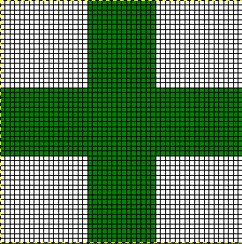
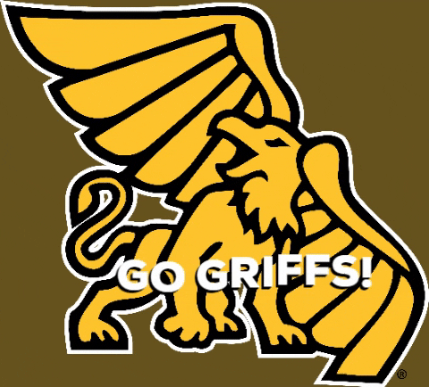
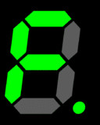
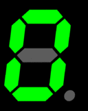

# 07_60 Images and Image Files

***TL;DR*** Only use .jpg files for photographs.  Use .png or .gif files for all other images

## References

Chapter 5 of the textbook does a good job covering basic file types.

Chapter 14 covers some advance and specialized CSS for images.  It will not be covered here.

## Raster vs Vector Graphics

Raster Graphics are a series of dots or pixels.

 This is a raster graphic of a green plus sign.

  This is an "exploded" version showing the individual pixels.

Raster or "bit mapped" graphics are series of dots.  They have a fixed size.  They usually do not look good if you enlarge them, and even reducing their sizes can distort them if you are not careful.

Vector graphics are more like an artist would draw with colored pencils.  The lines making up the image are recorded.  Each line (vector) in the image is recorded as a mathmatical expression.  At least in theory there is no size associated with a vector image file.  It should look as sharp and clear as a postage stamp or enlarged to a billboard.  Typically it does not work well with photographs; it is good for things like company logos.

## Image file formats

* **.bmp files** Bitmap files are simply recording the collor of each pixel.  The problem is these files are typically huge.  *Never use them on a web page.*  They are technically "lossless"
* **.gif files** 
  * These files tried to compress simple .bmp files. 
  * Gif files do a good job compressing files with long horizontal elements.  
  * Their big limitation is they only do 256 colors.  Therefore they are not good for most photgraphs
  * They can have transparent background
  * Several individual images may be put in the same file to create animations. 
    *  
    *  
    *  
    * [and even more](https://giphy.com/missouriwestern)!
  * For the above green plus image, the file would record for the first row:
  
      20 white cells, 10 green cells, 20 white cells.  
* **.png files**
  * .png are a more modern version of gifs
  * Can display full color including photographs.
  * Lossless
  * For photographs they are much larger than .jpg files
* **.jpg files**
  * Great for photographs because they are compact.
  * Lossy -- They lose details every time you edit them, so always preserve the original file and edit the original.
  * Do not use for simple high-contrast graphics like logos.  I found this monstrosity on the Missouri Western website.   Look at the jpg artifacts in the yellow areas.
  * Text and jpg are often a bad combination. 
* **.svg**
  * Not supported by some browsers.
  * In most cases the best practice is to save the file as a .png file at the desired resolution.
  * html5 has provisions for injecting svg images and text as images over photos or on web pages, but that is beyond the scope of what we will do in class.

## Image Sizes by type
| .bmp | .jpg | .png | .gif |
|:---:|:---:|:---:|:---:|
|  | | | |
|81 KB | 26 KB | 61 KB | 17 KB |
| | | | |
|  | | | |
|82 KB | 7 KB | 22 KB | 29 KB |

## Changing Image Sizes

* Only reduce the size of an image.  *Never try to increase an image size unless it is an .svg file*
* The image of the picture that is downloaded should match the size of the image on the page.
  * Downloading too large an image uses excessive bandwidth
  * Downloading too large an image slows download of the page
* Use pixels for image sizes
* Specify the width and the height if possible
  * Prevents jumping around
  * For a large website try to standardize image dimensions and specify them in CSS.  

### Video on changing image sizes

[Video on changing file sizes](https://mwsu.hosted.panopto.com/Panopto/Pages/Viewer.aspx?id=66f0c0a2-6720-437b-8f4b-aadd015a547b) using MicroSoft Paint on Windows

The video also covers

* Displaying file extensions in Windows
* Using ```clear``` to clean up after a ```float```
* Preserve the original image, and make new edits from the original whenever possible

## Programs for manipulating images

* MS Paint -- Often maligned, but actually it is useful for simple tasks.
  * Relatively easy to use
  * Good for resizing an image
  * Good for figuring out the size of an image
  * Good for changing file type
  * Good for cropping images
  * Mediocre for adding text because it does not have layers
  * Can't do transparency, although more recent versions preserve transparency
* Photoshop
  * The gold standard for image manipulation
  * Expensive and complex interface
  * Can do almost anything to a photo
* Gimp
  * Free
  * Tries to do everything Photoshop does, and is mostly successful
  * Complex interface

## Alignment of Images

* The book covers a lot of alignment information I do not plan to cover.

## The &lt;figure&gt; tag

The &lt;figure&gt; tag is a paired tag that allows adding captions to an image.  You may have more than one image in a figure, but all will have the same caption.

```html
<figure>
   
   <p>
   <figcaption>
      This is a picture of me on vacation.
   </figcaption>
</figure>
```
