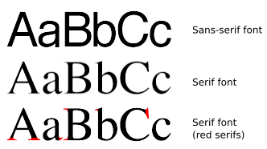

# 07c Fonts

## References

* [CSS Websafe fonts on W3C](https://www.w3schools.com/cssref/css_websafe_fonts.asp)
* [font-family](https://www.w3schools.com/cssref/css_websafe_fonts.asp) (same link as websafe fonts)
* [font-size](https://www.w3schools.com/cssref/pr_font_font-size.asp)
* [font-weight]()
* [HTML Entities](https://www.w3schools.com/html/html_entities.asp)
* [Google Fonts](https://fonts.google.com/)  The amount on the exam regarding Google Fonts will be limited.  In most cases you are going to go to the web site and get the code, so there is no point testing on it.

## Best practices

Don't use more than two or three fonts on a given web page.  Things can look cluttered pretty quickly if you use too many fonts on a page.

## Font Families



* **Serif** 
  * Serifs are the little do-dads on the corners of fancy printing
  * Serifs lead the eye along.
    * That makes it easier to read
    * The body text of most books are serif fonts
* **Sans Serif**
  * "Sans" is French for "without." So "Sans Serif" means "Without little do-dads on the corners"
  * Sans Serif fonts tend to catch the eye and hold it
  * Widely used in advertising, headlines, etc where you want to catch people's attention.
* **Script** Represent some type of handwriting or non-standard printing
* **Novelty & Symbols**  May include symbols or just type faces you would only use in odd situations

The general rule is that serif fonts are used in the body of text and sans serif are used in headlines.  But there are common exceptions

* Serif fonts are thought to lend dignity.  Things like law books and accounting textbookis may use serif fonts for everything because they are trying to appear authoritative.
* Sans Serif fonts are thought to be clean and modern.

Google fonts has a category called "Display Fonts"  It includes fonts that are generally bold and intended to be used for headings.  Would you expect these to be serif or sans serif fonts?

## Font Width

* Proportional fonts
  * Each letter may have a different width.  "M" or "W" is wider than "i" or "."
  * Generally provides smoother reading and more attractive text
  * Most modern applications use proportional fonts
* Monospaced or Fixed Width fonts
  * All characters are the same width.
  * May be serif or san serif.
  * Good for arranging things into columns
  * Most san serif fonts used in it applications try to reduce ambiguities.  For example, they clearly distinguish between a capital I, lower case l, and the digit 1.
  

## Fonts you should know for the exam

* **Roman**
  * Serif, proportional font
  * Used for old newspapers (Before the New York Times)
  * Dignified and authoritative
* **Times Roman** or Times New Roman
  * Compressed version of Roman
  * If you have 4 pages of material for a 5 page paper, Times Roman is *not* your friend (Hint: Use Schoolbook)
  * If you are paying for photocopies of a long document Times Roman *is* your friend
* **Arial** or Helvetica
  * These are very similar fonts.  Helvetica is the name you usually see on Macs.  Arial is on everything else.
  * Proportional sans serif
*  **Courier** or Courier New
  * This is a fixed with serif font
  * Used on old typewriters
  * Takes up a lot of space
* **Lucinda Console**
  * Lucinda is a family of fonts intended to remain legible at small sizes
  * Lucinda Console is sans serif and monospaced
  * Popular with programmers and in console applications

## Web Safe Fonts

For a font to display it has to be installed on your computer.  Some common fonts are assumed to be on most computers and therefore they are considered "Web Safe"  See the [W3C Schools page on Web Safe fonts](https://www.w3schools.com/cssref/css_websafe_fonts.asp)

### CSS for the [font-family]()

```css
p {
  font-family: "Times New Roman", Times, serif;
}
h1, h2, h3 {
  font-family: Arial, Helvetica, sans-serif;
}
```

Font names with blanks must have quote marks around them. You may use either double or single quotes.

It is normal to give one or two alternative fonts.  If the first font is not available the fallback will be used.  The final option should be "serif" "sans-serif" or "monospace."

## Other CSS font specifications

* [font-size](https://www.w3schools.com/cssref/pr_font_font-size.asp)
  * May specify px, em, or %
  * There are also names like "large" and tiny.  See https://www.w3schools.com/cssref/pr_font_font-size.asp
  * h1 is typically 200%, and p is typically 75%
* [font-weight](https://www.w3schools.com/cssref/pr_font_weight.asp)
  * text values are normal|bold|bolder|lighter
  * Numeric values go from 100 to 900.
    * 700 is bold
    * Normal is either 400 or 500 depending on which source you use

```css
figcaption {font-weight: 600;}
p {font-weight: normal;}
```

## HTML Entities

See [HTML Entities](https://www.w3schools.com/html/html_entities.asp)

* HTML Entites are special characters like &cent;.  
  * Some for characters not on the keyboard
  * Some for characters that have special meaning in html like &lt; and &gt;
  * Forming diacritical marks in other languages
* All entities start with the & (ampersand) symbol and end with a ; (semicolon).
* Between the & and the ; they may either have a name or a number.

### Entities to know

* &amp;nbsp; -- Non-breaking space.  Also does not collapse with other white space
* &amp;lt; -- Less than space.  You can't just type the &lt; space in an html document!
* &amp;amp; -- The ampersand symbol itself.  It is often hard to type &amp; in a web page.
* &amp;copy; -- The copyright symbol @;

## Google fonts

Google fonts provide a wider range of fonts.  Also, I have found that a lot of systems no longer have all of the "websafe" fonts installed, so they need to be downloaded anyway.

There is a two-step process for using Google Fonts

1. Put a link to the stylesheet in the head of the document.  Google fonts itself helps you come up with this
2. Put the specified class in the elements you want to use that font.