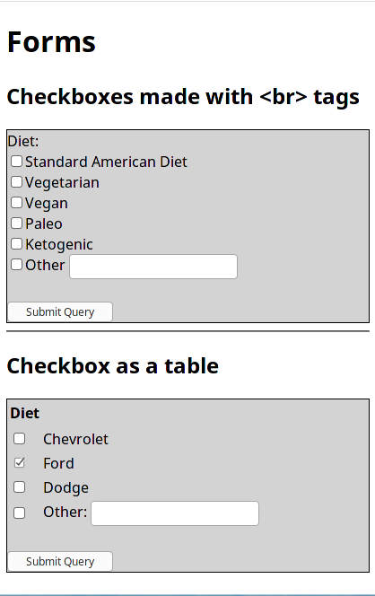
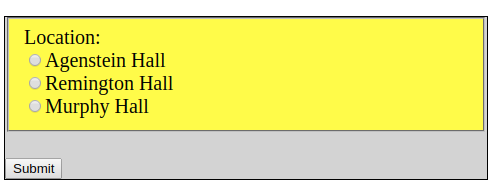

# 10b Additional Basic Input Fields


### &lt;textarea name="comments"> 

Textareas are used when there are multiple lines or paragraphs of text rather than a single line.  You should specify the width and height in css.

Textareas is a paired tag.  Anything between the tags is the default content.

```html
<form method="GET" action="https://webservices.missouriwestern.edu/users/noynaert/act102/api/generic.php">
        <textArea name="age" value="18">
              Put your comments here. 
        </textArea>
    <br>
    <input type="submit" value="Go for it!">
</form>
```


### Checkboxes

Checkboxes are often grouped.  Sometimes you will create a div with a border around the div.  

Each textbox in the group has to have exactly the same name.  The value is what is sent to the action url.  The values should be lower case, descriptive and single words or camelCase.

The following code shows two text boxes.  One uses a div, the other uses a tables with no borders.

```html
<h1>Forms</h1>
    <h2>Checkboxes made with &lt;br&gt; tags</h2>
    <form method="GET" action="https://webservices.missouriwestern.edu/users/noynaert/act102/api/generic.php">
       <div>   
         <label>Diet:</label> <br>
          <input type="checkbox" name="diet" value="sad">Standard American Diet<br>
          <input type="checkbox" name="diet" value="vegetarian">Vegetarian<br>
          <input type="checkbox" name="diet" value="vegan">Vegan<br>
          <input type="checkbox" name="diet" value="paleo">Paleo<br>
          <input type="checkbox" name="diet" value="keto">Ketogenic<br>
          <input type="checkbox" name="diet" value="other">Other <input type="text" name="otherDiet">  
       </div>
       <br>
       <input type="submit">
      </form>

      <hr>
     <h2>Checkbox as a table</h2>
      <form method="GET" action="https://webservices.missouriwestern.edu/users/noynaert/act102/api/generic.php">
        <table>
            <tr><th>Diet</th><th>&nbsp;</th></tr>
            <tbody>
  
            </tbody>
            <tr><td><input type="checkbox" name="vehicle" value="chevy"></td><td>Chevrolet</td></tr>
            <tr><td><input type="checkbox" name="vehicle" value="ford" checked></td><td>Ford</td></tr>
            <tr><td><input type="checkbox" name="vehicle" value="dodge"></td><td>Dodge</td></tr>
            <tr><td><input type="checkbox" name="vehicle" value="other"></td><td>Other: <input type="text" name="otherVehicle"></td></tr>
        </table>
        <br>
         <input type="submit">
        </form>
```



### Radio Buttons 


Old-time cars had radios with buttons.  Each button could be assigned a station.  When you pushed in one button, any other buttons popped out. Therefore only one button could be pressed at a time.

The idea with radio buttons is that only one may be selected at a time.  Once a button is checked or selected it may only be unselected by picking another button.

```html
<form method="GET" action="https://webservices.missouriwestern.edu/users/noynaert/act102/api/generic.php">
      <fieldset id=location style="background-color:yellow">
         <label>Location:</label> <br>
          <input type="radio" name="location" value="agenstein">Agenstein Hall<br>
          <input type="radio" name="location" value="remington">Remington Hall<br>
          <input type="radio" name="location" value="murphy">Murphy Hall<br>
      </fieldset>
       <br>
       <input type="submit">
      </form>
```


#### &lt;fieldset>

The &lt;fieldset> is a fairly new html tag.  It is meant to group related controls.  Previous versions of html would have just used a <div> in most cases.  Note that &lt;br> tags are still required.

Browsers are supposed to show fieldset with the following default CSS.  However, the CSS can be modified.

```css
fieldset {
  display: block;
  margin-left: 2px;
  margin-right: 2px;
  padding-top: 0.35em;
  padding-bottom: 0.625em;
  padding-left: 0.75em;
  padding-right: 0.75em;
  border: 2px groove (internal value);
}
```
