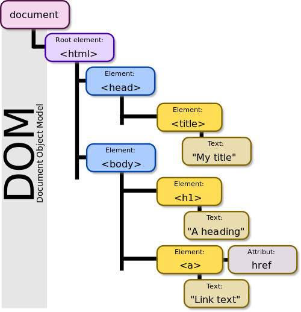

# 13a About JavaScript

## History


* What we now know as JavaScript was developed in 1995 by Netscape, a forerunner of the FireFox browser.
* Technically, JavaScript is known as ECMAScript.
  * Currently we are on ES6
  * Don't use any tutorials from before 2016 because they may refer to old versions of ES6

## JavaScript is in the browser

With most computer languages a developer must download a compiler or interpreter for the language.  That is not true with JavaScript when it is used in web pages.  A JavaScript interpreter is built into most browsers.  You only have to download JavaScript if you are doing server-side scripting.

### The Browser Wars

In the late 1990s we had the "Browser War."  Each browser had its own version of JavaScript.  Each had its own features, and sometimes one browser would actually try to "break" code written for a different browser.  Microsoft was the worst with its Internet Explorer.

The European Computer Manufacturers Association (ECMA) ended the browser wars.  They standardized the "DOM" and JavaScript.  The various browsers ended the Browser War and all standardized on the ECMA DOM and JavaScript.  In fact, technically modern JavaScript is "EcmaScript" but we generally use the name JavaScript anyway.

The current version of JavaScript or ***EcmaScript*** was released in late 2015.  There have been minor revisions since then, but the core of EcmaScript is unchanged from 2015.  ***Do not trust any JavaScript video or article written before 2016.*** It probably uses an old version of JavaScript.

## Other Versions of JavaScript

* Node.JS is a version of JavaScript designed to work at the command line.
  * It runs outside the browser
  * It comes with a program called "npm" or "Node Package Manager"
    * Sometimes we load node.js just so we can use npm
* TypeScript
  * TypeScript is a product of Microsoft
  * TypeScript uses data types
  * TypeScript compiles into JavaScript

## JavaScript is not Java

JavaScript and Java are two different languages although they were developed at roughly the same time.  There are a few elements of syntax they have in common, but there are many differences

Java is a true Object-Oriented Language that uses classes to define objects.  JavaScript also has objects, but it is a much looser form of objects based on prototypes rather than classes.

## The DOM

DOM stands for "Document Object Model."  

```html
<!DOCTYPE html>
<html>
  <head>
    <title>My Title</title>
  </head>
  <body>
    <h1>A heading</h1>
    <a href="example.png">Link text</a>
  </body>
</html>
```

The above html would generate the following DOM.  The browser reads the code and organizes it into a tree-like structure as shown below.



## Javascript is about manipulating the DOM

The primary use for JavaScript is "Manipulating the DOM."  JavaScript can read from the DOM and also change the DOM after the page loads.

JavaScript does three things with the DOM

1. JavaScript can query the DOM.  The main use is getting values from input fields
2. Detect events happening with the DOM
3. Change the DOM after the page loads.